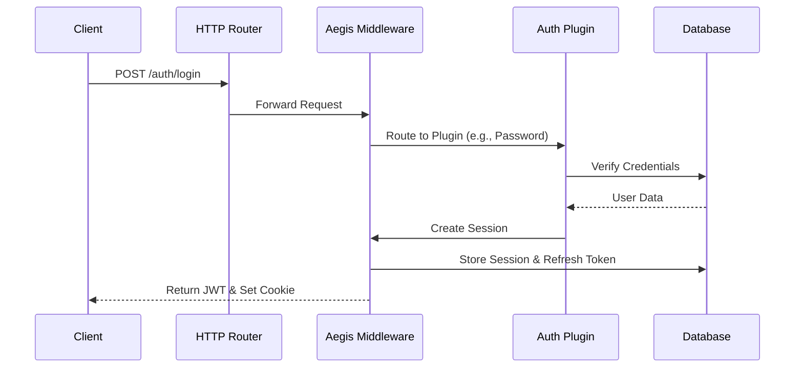

# Architecture & Project Flow

This document describes the internal architecture of Aegis and how data flows through the system.

## High-Level Overview

Aegis is designed as a **modular middleware** that sits between your HTTP router and your application logic. It handles authentication requests, manages sessions, and provides a unified identity layer.

### The Core Components

1.  **Core Library (`aegis` package)**: The entry point. It initializes the system, manages configuration, and mounts the main router.
2.  **DB Provider (`db` package)**: A unified interface for database operations. It abstracts away the specific SQL dialect (PostgreSQL, MySQL, SQLite).
3.  **Session Manager**: Handles the creation, validation, and revocation of session tokens (JWTs) and refresh tokens.
4.  **Plugin System (`plugins` package)**: The extension mechanism. All specific auth methods (Email, OAuth, etc.) are plugins.

## Request Flow

Here is how a typical request flows through Aegis:

## Detailed Component Interaction

### 1. Initialization

When you call `aegis.New()`, the following happens:
- The **DB Provider** is initialized with your SQL connection.
- The **Router** is set up.
- **Plugins** are registered via `auth.Use()`. Each plugin:
    - Validates its dependencies.
    - Registers its own routes (e.g., `/email/login`).
    - Migrates its own tables (if using the CLI).

### 2. Authentication

When a user authenticates (e.g., via `plugins/password`):
1.  The plugin validates the input.
2.  It uses the `DBProvider` to check credentials against the `auth.accounts` table.
3.  If valid, it calls `aegis.CreateSession(user)`.
4.  Aegis generates a **JWT** (short-lived) and a **Refresh Token** (long-lived).
5.  The Refresh Token is stored in `auth.session`.

### 3. Session Validation (Middleware)

For protected routes in your app:
1.  The Aegis middleware intercepts the request.
2.  It checks for the JWT in the `Authorization` header or Cookie.
3.  It verifies the JWT signature using the keys in `auth.jwks`.
4.  If valid, it injects the `User` object into the request context.
5.  Your handler accesses the user via `aegis.GetUser(r.Context())`.

## Data Model

The core data model is designed to be minimal and extensible.

- **User (`auth.user`)**: The identity.
- **Account (`auth.accounts`)**: The "credential". A user can have multiple accounts (e.g., a password account AND a Google account).
- **Session (`auth.session`)**: The active login state.

Plugins can extend this by adding their own tables, but they should link back to `auth.user`.
