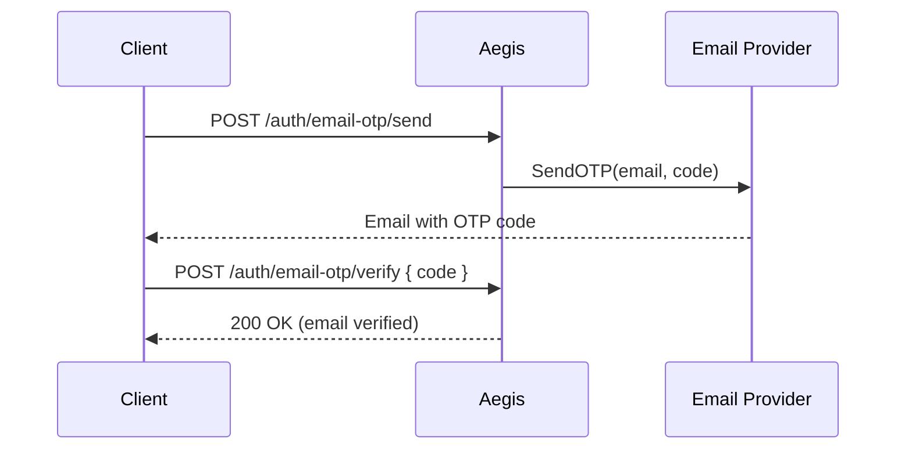

Aegis provides email-based authentication and OTP verification through the `emailotp` plugin. The plugin manages OTP generation, delivery, and validation while giving you full control over how emails are sent via a simple `Provider` interface.

## Email OTP Plugin

### Setup

```go
import (
    "github.com/theinventorylib/aegis"
    "github.com/theinventorylib/aegis/config"
    "github.com/theinventorylib/aegis/plugins"
    "github.com/theinventorylib/aegis/plugins/emailotp"
)

// 1. Implement the Provider interface (see below)
provider := &MySMTPProvider{...}

// 2. Configure the plugin
otpPlugin := emailotp.New(&emailotp.Config{
    Provider:  provider,
    OTPExpiry: 10 * time.Minute, // default
    OTPLength: 6,                // default
}, nil, plugins.DialectPostgres)

// 3. Register with Aegis
a, _ := aegis.New(ctx, cfg)
a.Use(ctx, otpPlugin)
a.MountRoutes("/auth")
```

This mounts the following routes automatically:

| Method | Path                      | Access    | Description                       |
|--------|---------------------------|-----------|-----------------------------------|
| POST   | `/auth/email-otp/send`    | Protected | Send OTP to authenticated user    |
| POST   | `/auth/email-otp/verify`  | Public    | Verify submitted OTP code         |
| POST   | `/auth/email-otp/register`| Public    | Register with email + password    |
| POST   | `/auth/email-otp/login`   | Public    | Login with email + password       |

### Plugin Config

```go
type Config struct {
    Provider  Provider      // Email sending provider (required for production)
    OTPExpiry time.Duration // OTP expiry duration (default: 10 minutes)
    OTPLength int           // OTP code length (default: 6)
}
```

---

## Provider Interface

To send emails, implement the `emailotp.Provider` interface:

```go
type Provider interface {
    // SendOTP sends a one-time password to the specified email address.
    SendOTP(to, code string) error

    // VerifyOTP verifies an OTP code for an email address.
    // Most implementations return (true, nil) and delegate
    // verification to the plugin's own OTP storage.
    VerifyOTP(to, code string) (bool, error)
}
```

### SMTP Provider Example

```go
import (
    "fmt"
    "net/smtp"
    "strconv"
)

type SMTPProvider struct {
    host     string
    port     int
    username string
    password string
    from     string
}

func (p *SMTPProvider) SendOTP(to, code string) error {
    subject := "Your Verification Code"
    body := fmt.Sprintf(
        "Your verification code is: %s\n\nThis code expires in 10 minutes.",
        code,
    )
    auth := smtp.PlainAuth("", p.username, p.password, p.host)
    msg := fmt.Sprintf(
        "From: %s\r\nTo: %s\r\nSubject: %s\r\n\r\n%s",
        p.from, to, subject, body,
    )
    return smtp.SendMail(
        p.host+":"+strconv.Itoa(p.port),
        auth, p.from, []string{to}, []byte(msg),
    )
}

func (p *SMTPProvider) VerifyOTP(to, code string) (bool, error) {
    // Verification is handled by the plugin's OTP storage.
    return true, nil
}
```

### SendGrid Example

```go
import (
    "fmt"
    "github.com/sendgrid/sendgrid-go"
    "github.com/sendgrid/sendgrid-go/helpers/mail"
)

type SendGridProvider struct {
    apiKey string
    from   string
}

func (p *SendGridProvider) SendOTP(to, code string) error {
    message := mail.NewV3Mail()
    message.SetFrom(mail.NewEmail("", p.from))
    message.AddContent(mail.NewContent("text/plain",
        fmt.Sprintf("Your OTP: %s", code),
    ))
    personalization := mail.NewPersonalization()
    personalization.AddTos(mail.NewEmail("", to))
    message.AddPersonalizations(personalization)

    client := sendgrid.NewSendClient(p.apiKey)
    _, err := client.Send(message)
    return err
}

func (p *SendGridProvider) VerifyOTP(to, code string) (bool, error) {
    return true, nil
}
```

### Resend Example

```go
import "github.com/resendlabs/resend-go"

type ResendProvider struct {
    apiKey string
    from   string
}

func (p *ResendProvider) SendOTP(to, code string) error {
    client := resend.NewClient(p.apiKey)

    _, err := client.Emails.Send(&resend.SendEmailRequest{
        From:    p.from,
        To:      []string{to},
        Subject: "Your verification code",
        Text:    fmt.Sprintf("Your code is: %s\n\nExpires in 10 minutes.", code),
    })
    return err
}

func (p *ResendProvider) VerifyOTP(to, code string) (bool, error) {
    return true, nil
}
```

---

## Programmatic Usage

### Send OTP

```go
// Send OTP with a specific purpose (e.g., "email_verification", "password_reset")
err := otpPlugin.SendOTP(ctx, "user@example.com", "email_verification")
if err != nil {
    return fmt.Errorf("failed to send OTP: %w", err)
}
```

### Verify OTP

```go
valid, err := otpPlugin.VerifyOTP(ctx, "user@example.com", "482731")
if err != nil || !valid {
    return errors.New("invalid or expired OTP")
}

// Mark email as verified
err = otpPlugin.MarkEmailVerified(ctx, "user@example.com")
```

### Register with Email + Password

```go
user, err := otpPlugin.CreateUserWithEmailAndPassword(
    ctx,
    "John Doe",         // Name
    "user@example.com", // Email
    "MySecurePass123!", // Password (hashed with Argon2id)
)
if err != nil {
    return err
}
```

---

## Email Verification Flow



1. Authenticated user calls `POST /auth/email-otp/send`
2. Plugin generates OTP and calls `provider.SendOTP(email, code)`
3. User submits code via `POST /auth/email-otp/verify`
4. Plugin validates code → email marked as verified

---

## Verification Tokens (Low-Level)

For custom flows that need raw token management, use `VerificationService` from the core `AuthService`:

```go
// Access via aegis auth service
verificationService := a.GetAuthService().Verification

// Create a token
verification, err := verificationService.CreateVerification(
    ctx,
    "user@example.com", // identifier
    "reset",            // type: "email", "reset", "otp", etc.
    1*time.Hour,        // expiry
    nil,                // nil = generate random token
)

// Send token in email via your provider
provider.SendOTP("user@example.com", verification.Token)

// Validate token
v, err := verificationService.ValidateVerification(ctx, token)
if err != nil {
    return errors.New("invalid or expired token")
}

// Clean up after use
verificationService.DeleteVerification(ctx, v.ID)
```

### Password Reset Flow (Custom)

```go
// 1. Create reset token
verification, err := verificationService.CreateVerification(
    ctx, "user@example.com", "reset", 1*time.Hour, nil,
)

// 2. Send via your provider
resetURL := fmt.Sprintf("https://example.com/reset?token=%s", verification.Token)
provider.SendOTP("user@example.com", resetURL)

// 3. Validate when user clicks link
v, err := verificationService.ValidateVerification(ctx, token)
if err != nil {
    return errors.New("invalid or expired reset token")
}

// 4. Update password
err = a.GetAuthService().Account.UpdatePassword(ctx, userID, "NewSecurePassword456!")

// 5. Invalidate token
verificationService.DeleteVerification(ctx, v.ID)

// 6. Optional: invalidate all sessions
a.GetAuthService().Session.InvalidateAllSessions(ctx, userID)
```

---

## Security Best Practices

### Prevent Email Enumeration

```go
// ❌ Bad: reveals if email exists
user, err := store.GetUserByEmail(ctx, email)
if err != nil {
    return errors.New("email not found") // Attacker learns email doesn't exist
}

// ✅ Good: always respond the same way
_ = store.GetUserByEmail(ctx, email)
return nil // Always return success — send email if it exists
```

### Token Security

```go
// ✅ Cryptographically secure tokens (auto-generated by VerificationService)
verification, _ := verificationService.CreateVerification(
    ctx, email, "email", 24*time.Hour, nil,
)
// Generates 64-character hex token (32 bytes of entropy)

// ❌ Avoid predictable tokens
badToken := fmt.Sprintf("%d", time.Now().Unix()) // Predictable!
```

---

## User Enrichment

When the `emailotp` plugin is registered, it automatically adds email verification status to authenticated users:

```go
user := core.GetEnrichedUser(r.Context())
if user != nil {
    verified, _ := user.Get("emailVerified").(bool)
    // true if email has been verified via OTP
}
```

---

## API Reference

### emailotp.Provider

```go
type Provider interface {
    SendOTP(to, code string) error
    VerifyOTP(to, code string) (bool, error)
}
```

### emailotp.Config

```go
type Config struct {
    Provider  Provider      // Email sending provider
    OTPExpiry time.Duration // Default: 10 minutes
    OTPLength int           // Default: 6 digits
}
```

### emailotp.Plugin Methods

```go
// Send OTP code to email for a given purpose
func (p *Plugin) SendOTP(ctx context.Context, emailAddress, purpose string) error

// Verify OTP code
func (p *Plugin) VerifyOTP(ctx context.Context, emailAddress, code string) (bool, error)

// Mark email as verified (called automatically by VerifyOTPHandler)
func (p *Plugin) MarkEmailVerified(ctx context.Context, email string) error

// Register a new user with email + password
func (p *Plugin) CreateUserWithEmailAndPassword(ctx context.Context, name, email, password string) (*User, error)

// Update email address and verification status
func (p *Plugin) UpdateUserEmail(ctx context.Context, userID, email string, verified bool) error
```

### core.VerificationService

```go
// Create a verification token
func (s *VerificationService) CreateVerification(
    ctx context.Context,
    identifier string,   // Email, phone, user ID
    vType string,        // "email", "reset", "otp", etc.
    expiry time.Duration,
    customToken *string, // Optional; nil = auto-generate
) (auth.Verification, error)

// Validate token (checks existence and expiry)
func (s *VerificationService) ValidateVerification(
    ctx context.Context,
    token string,
) (auth.Verification, error)

// Delete a token after use
func (s *VerificationService) DeleteVerification(ctx context.Context, id string) error

// Invalidate all tokens of a type for an identifier
func (s *VerificationService) InvalidateVerification(ctx context.Context, identifier, vType string) error
```

### auth.Verification Model

```go
type Verification struct {
    ID         string    // Unique identifier
    Identifier string    // Email/phone being verified
    Token      string    // Verification code/token
    Type       string    // "email", "reset", "otp", etc.
    ExpiresAt  time.Time // Token expiration
    CreatedAt  time.Time // Creation timestamp
}
```

---

## See Also

- [Users & Accounts](/concepts/users-accounts) — User creation and management
- [Rate Limiting](/concepts/rate-limit) — Protect against abuse
- [Sessions](/concepts/sessions) — Post-authentication session handling
- [Email OTP Plugin](/plugins/email-otp) — Full plugin reference
