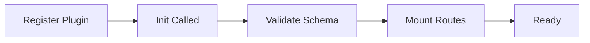

Aegis uses a plugin architecture to extend core authentication with features like OAuth providers, multi-tenancy, admin panels, and custom workflows. Plugins are self-contained modules with their own schemas, routes, and logic.

## Plugin Architecture

### Core Plugin Interface

Every plugin implements the `Plugin` interface:

```go
type Plugin interface {
    // Identity
    Name() string        // Plugin identifier (e.g., "sms", "oauth", "email")
    Version() string     // Plugin version
    Description() string // Human-readable description

    // Lifecycle
    Init(ctx context.Context, a Aegis) error // Initialize plugin with Aegis instance
    GetMigrations() []Migration              // Return plugin-specific migrations

    // Routing
    MountRoutes(router router.Router, prefix string) // Register HTTP routes

    // Metadata
    Dependencies() []Dependency    // Informational only
    RequiresTables() []string      // Informational only
    ProvidesAuthMethods() []string // Informational only
}
```

### Plugin Lifecycle



1. **Registration**: Add plugin to Aegis config
2. **Initialization**: `Init()` receives Aegis instance
3. **Schema Validation**: Check required tables exist
4. **Route Mounting**: Register HTTP handlers
5. **Ready**: Plugin fully integrated

## Plugin Lifecycle (Init, MountRoutes)

### Init Phase

Plugins receive the `Aegis` interface during initialization:

```go
type Aegis interface {
    GetAuthService() *core.AuthService
    GetLogger() config.Logger
    GetRateLimiter() *core.RateLimiter
    DeriveSecret(purpose string) []byte
    DB() *sql.DB
    ValidateSchemaRequirements(ctx context.Context, requirements []SchemaRequirement) error
    GetPlugin(name string) (Plugin, bool)
}
```

Example plugin `Init()`:

```go
func (p *MyPlugin) Init(ctx context.Context, aegis plugins.Aegis) error {
    // Store Aegis reference
    p.aegis = aegis
    
    // Get dependencies
    p.authService = aegis.GetAuthService()
    p.logger = aegis.GetLogger()
    
    // Derive plugin-specific secret
    p.secret = aegis.DeriveSecret("myplugin")
    
    // Validate schema requirements
    requirements := []plugins.SchemaRequirement{
        plugins.ValidateTableExists("my_plugin_table"),
        plugins.ValidateColumnExists("my_plugin_table", "user_id"),
    }
    if err := aegis.ValidateSchemaRequirements(ctx, requirements); err != nil {
        return fmt.Errorf("schema validation failed: %w", err)
    }
    
    return nil
}
```

### MountRoutes Phase

Register HTTP endpoints:

```go
func (p *MyPlugin) MountRoutes(router router.Router, prefix string) {
    // Plugin routes mounted at /auth/<prefix>/<path>
    router.Get(prefix+"/status", p.handleStatus)
    router.Post(prefix+"/action", p.handleAction)
    
    // Protected routes
    router.Group(func(r router.Router) {
        r.Use(p.aegis.GetAuthService().RequireAuth())
        r.Get(prefix+"/protected", p.handleProtected)
    })
}
```

Mounted at: `/auth/myplugin/status`, `/auth/myplugin/action`, etc.

## Optional Plugin Interfaces

Beyond the required `Plugin` interface, aegis recognises several optional interfaces that unlock additional framework features. Implement only the ones you need.

### PluginShutdown — Graceful Cleanup

Called by `aegis.Shutdown(ctx)` when the application is stopping. Plugins are shut down in reverse priority order (application plugins before system plugins).

```go
type PluginShutdown interface {
    Shutdown(ctx context.Context) error
}

// Example: close background workers or flush buffers
func (p *MyPlugin) Shutdown(ctx context.Context) error {
    p.stopWorker()
    return p.db.Close()
}
```

Trigger shutdown on SIGINT / SIGTERM:

```go
ctx, stop := signal.NotifyContext(context.Background(), os.Interrupt, syscall.SIGTERM)
defer stop()

<-ctx.Done()

shutdownCtx, cancel := context.WithTimeout(context.Background(), 10*time.Second)
defer cancel()
if err := a.Shutdown(shutdownCtx); err != nil {
    log.Error("shutdown error", "err", err)
}
```

### PluginRequires — Declare Plugin Dependencies

If your plugin depends on another plugin being registered first, implement `PluginRequires`. Aegis validates this during `a.Use()` — registration fails early with a clear error if a required plugin is missing.

```go
type PluginRequires interface {
    Requires() []string // list of plugin names that must be registered before this one
}

func (p *MyPlugin) Requires() []string {
    return []string{"oauth"} // Aegis will error if "oauth" is not already registered
}
```

### PluginVersionRequires — Versioned Dependencies

Use `PluginVersionRequires` when you need a specific minimum version of a dependency.

```go
type PluginVersionRequires interface {
    VersionedRequires() []VersionedRequirement
}

func (p *MyPlugin) VersionedRequires() []plugins.VersionedRequirement {
    return []plugins.VersionedRequirement{
        {Plugin: "oauth", MinVersion: "1.2.0"},
    }
}
```

### PluginMinAegisVersion — Framework Version Gate

Declare the minimum Aegis framework version your plugin requires. Aegis checks this against `aegis.Version` at `a.Use()` time.

```go
type PluginMinAegisVersion interface {
    MinAegisVersion() string
}

func (p *MyPlugin) MinAegisVersion() string {
    return "0.5.0" // minimum aegis version required
}
```


### Basic Plugin Structure

```go
package myplugin

import (
    "context"
    "github.com/theinventorylib/aegis/plugins"
    "github.com/theinventorylib/aegis/router"
)

type Plugin struct {
    config *Config
    aegis  plugins.Aegis
}

type Config struct {
    Option1 string
    Option2 int
}

func New(cfg *Config) *Plugin {
    return &Plugin{
        config: cfg,
    }
}

// Plugin interface implementation
func (p *Plugin) Name() string { return "myplugin" }
func (p *Plugin) Version() string { return "1.0.0" }
func (p *Plugin) Description() string { return "My custom plugin" }

func (p *Plugin) Init(ctx context.Context, aegis plugins.Aegis) error {
    p.aegis = aegis
    return nil
}

func (p *Plugin) GetMigrations() []plugins.Migration {
    return []plugins.Migration{
        {
            Version:     1,
            Description: "Initial schema",
            Up:          createTableSQL,
            Down:        dropTableSQL,
        },
    }
}

func (p *Plugin) MountRoutes(r router.Router, prefix string) {
    r.Get(prefix+"/hello", p.handleHello)
}

func (p *Plugin) Dependencies() []plugins.Dependency { return nil }
func (p *Plugin) RequiresTables() []string { return []string{"my_table"} }
func (p *Plugin) ProvidesAuthMethods() []string { return []string{"custom"} }
```

### Plugin with User Enrichment

Implement `UserEnricher` to add custom fields:

```go
type RolePlugin struct {
    aegis     plugins.Aegis
    roleStore RoleStore
}

// Plugin interface
func (p *RolePlugin) Name() string { return "roles" }
// ... other Plugin methods

// UserEnricher interface
func (p *RolePlugin) EnrichUser(ctx context.Context, user *core.EnrichedUser) error {
    role, err := p.roleStore.GetUserRole(ctx, user.ID)
    if err != nil {
        return err
    }
    
    user.Set("role", role.Name)
    user.Set("permissions", role.Permissions)
    
    return nil
}
```

After authentication, enriched user includes role data:

```go
user, _ := auth.GetEnrichedUser(ctx, userID)
role := user.Get("role")           // "admin"
perms := user.Get("permissions")   // ["read", "write", "delete"]
```

### Plugin with Database Access

```go
type AnalyticsPlugin struct {
    aegis plugins.Aegis
    db    *sql.DB
}

func (p *AnalyticsPlugin) Init(ctx context.Context, aegis plugins.Aegis) error {
    p.aegis = aegis
    p.db = aegis.DB()
    
    // Validate schema
    requirements := []plugins.SchemaRequirement{
        plugins.ValidateTableExists("analytics_events"),
    }
    return aegis.ValidateSchemaRequirements(ctx, requirements)
}

func (p *AnalyticsPlugin) TrackEvent(ctx context.Context, eventType string, userID string, metadata map[string]any) error {
    query := `
        INSERT INTO analytics_events (id, event_type, user_id, metadata, created_at)
        VALUES ($1, $2, $3, $4, $5)
    `
    metadataJSON, _ := json.Marshal(metadata)
    _, err := p.db.ExecContext(ctx, query, generateID(), eventType, userID, metadataJSON, time.Now())
    return err
}
```

## Plugin Composition

### Multiple Plugins

```go
cfg := config.Default().
    WithDB(db).
    WithRouter(r).
    WithSecret([]byte("your-secret-key-must-be-32-chars!"))

a, err := aegis.New(ctx, cfg)
if err != nil {
    log.Fatal(err)
}

// Register plugins individually
a.Use(ctx, oauth.New(oauthConfig, nil))
a.Use(ctx, organizations.New(orgConfig, nil))
a.Use(ctx, admin.New(adminConfig, nil))
a.Use(ctx, jwt.New(jwtConfig, nil))
```

Plugins are initialized in order and can depend on each other:

```go
func (p *MyPlugin) Init(ctx context.Context, aegis plugins.Aegis) error {
    // Check if OAuth plugin is loaded
    oauthPlugin, ok := aegis.GetPlugin("oauth")
    if !ok {
        return errors.New("oauth plugin required")
    }
    
    // Use OAuth plugin functionality
    p.oauthPlugin = oauthPlugin.(*oauth.Plugin)
    return nil
}
```

### Plugin Communication

```go
type WebhookPlugin struct {
    aegis         plugins.Aegis
    auditLogger   core.AuditLogger
}

func (p *WebhookPlugin) Init(ctx context.Context, aegis plugins.Aegis) error {
    p.aegis = aegis
    
    // Hook into audit logging
    p.auditLogger = &WebhookAuditLogger{
        webhookURL: "https://example.com/webhooks",
    }
    
    return nil
}

// Audit logger sends webhooks on auth events
type WebhookAuditLogger struct {
    webhookURL string
}

func (l *WebhookAuditLogger) LogEvent(ctx context.Context, event *core.AuditEvent) error {
    return sendWebhook(l.webhookURL, map[string]any{
        "event":   event.EventType,
        "user_id": event.UserID,
        "success": event.Success,
        "details": event.Details,
    })
}

func (l *WebhookAuditLogger) LogAuthEvent(ctx context.Context, eventType core.AuditEventType, userID string, success bool, details map[string]any) error {
    payload := map[string]any{
        "event":   eventType,
        "user_id": userID,
        "success": success,
        "details": details,
    }
    return sendWebhook(l.webhookURL, payload)
}
```

## Schema Management per Plugin

### Plugin Migrations

Each plugin provides its own migrations:

```go
func (p *OAuth) GetMigrations() []plugins.Migration {
    return []plugins.Migration{
        {
            Version:     1,
            Description: "Create oauth_connections table",
            Up: `
                CREATE TABLE oauth_connections (
                    id TEXT PRIMARY KEY,
                    user_id TEXT NOT NULL,
                    provider TEXT NOT NULL,
                    provider_user_id TEXT NOT NULL,
                    access_token TEXT,
                    refresh_token TEXT,
                    expires_at TEXT,
                    created_at TEXT NOT NULL,
                    updated_at TEXT NOT NULL,
                    UNIQUE(provider, provider_user_id),
                    FOREIGN KEY (user_id) REFERENCES "user"(id) ON DELETE CASCADE
                );
                CREATE INDEX idx_oauth_user_id ON oauth_connections(user_id);
                CREATE INDEX idx_oauth_provider ON oauth_connections(provider);
            `,
            Down: `DROP TABLE oauth_connections;`,
        },
    }
}
```

### Exporting Plugin Schemas

```bash
# Export OAuth plugin migrations
aegis export \
  --dialect postgres \
  --plugins oauth \
  --output ./migrations

# Export multiple plugins
aegis export \
  --dialect postgres \
  --plugins oauth,organizations,admin \
  --output ./migrations

# Export all available plugins
aegis export \
  --dialect postgres \
  --plugins all \
  --output ./migrations
```

Generated files:

```
migrations/
├── 001_initial.up.sql               # Core Aegis schema
├── 001_initial.down.sql
├── 002_oauth.up.sql                 # OAuth plugin
├── 002_oauth.down.sql
├── 003_organizations.up.sql         # Organizations plugin
├── 003_organizations.down.sql
├── 004_admin.up.sql                 # Admin plugin
└── 004_admin.down.sql
```

### Schema Validation

Plugins validate required schema before initialization:

```go
func (p *Plugin) Init(ctx context.Context, aegis plugins.Aegis) error {
    requirements := []plugins.SchemaRequirement{
        plugins.ValidateTableExists("my_table"),
        plugins.ValidateColumnExists("my_table", "user_id"),
        plugins.ValidateColumnExists("my_table", "data"),
    }
    
    if err := aegis.ValidateSchemaRequirements(ctx, requirements); err != nil {
        return fmt.Errorf("schema validation failed: %w", err)
    }
    
    return nil
}
```

## Advanced Plugin Examples

### Audit Trail Plugin

```go
package audit

type Plugin struct {
    aegis plugins.Aegis
    db    *sql.DB
}

func (p *Plugin) Init(ctx context.Context, aegis plugins.Aegis) error {
    p.aegis = aegis
    p.db = aegis.DB()
    return nil
}

func (p *Plugin) MountRoutes(r router.Router, prefix string) {
    r.Get(prefix+"/events", p.handleGetEvents)
    r.Get(prefix+"/events/:id", p.handleGetEvent)
}

func (p *Plugin) handleGetEvents(w http.ResponseWriter, r *http.Request) {
    // Get authenticated user
    user, _ := core.GetUser(r.Context())
    
    // Query audit events
    rows, _ := p.db.QueryContext(r.Context(), `
        SELECT id, event_type, metadata, created_at
        FROM audit_events
        WHERE user_id = $1
        ORDER BY created_at DESC
        LIMIT 100
    `, user.GetID())
    defer rows.Close()
    
    // Return events as JSON
    // ...
}
```

### Rate Limit Plugin

```go
package customlimit

type Plugin struct {
    aegis   plugins.Aegis
    limiter *core.RateLimiter
}

func (p *Plugin) Init(ctx context.Context, aegis plugins.Aegis) error {
    p.aegis = aegis
    
    // Create custom rate limiter
    p.limiter = core.NewRateLimiter(&core.RateLimitConfig{
        RequestsPerWindow: 100,
        WindowDuration:    time.Minute,
        ByUser:            true,
    }, nil, aegis.GetLogger())
    
    return nil
}

func (p *Plugin) MountRoutes(r router.Router, prefix string) {
    // Apply rate limiting to plugin routes
    r.Group(func(r router.Router) {
        r.Use(p.rateLimitMiddleware)
        r.Post(prefix+"/action", p.handleAction)
    })
}

func (p *Plugin) rateLimitMiddleware(next http.Handler) http.Handler {
    return http.HandlerFunc(func(w http.ResponseWriter, r *http.Request) {
        user, _ := core.GetUser(r.Context())
        allowed, retryAfter, _ := p.limiter.AllowRequest(r.Context(), user.GetID())
        
        if !allowed {
            w.Header().Set("Retry-After", retryAfter.String())
            http.Error(w, "Rate limit exceeded", http.StatusTooManyRequests)
            return
        }
        
        next.ServeHTTP(w, r)
    })
}
```

## API Reference

### Plugin Interface

```go
type Plugin interface {
    Name() string
    Version() string
    Description() string
    Init(ctx context.Context, aegis Aegis) error
    GetMigrations() []Migration
    GetSchemas() []Schema
    MountRoutes(router Router, prefix string)
    Dependencies() []Dependency
    RequiresTables() []string
    ProvidesAuthMethods() []string
}
```

### Aegis Interface

```go
type Aegis interface {
	GetAuthService() *core.AuthService                                                      // Returns the auth service for user operations
	GetLogger() config.Logger                                                               // Returns the configured logger (may be nil)
	GetRateLimiter() *core.RateLimiter                                                      // Returns the rate limiter (may be nil)
	DeriveSecret(purpose string) []byte                                                     // Derives a purpose-specific secret from the master secret
	DB() *sql.DB                                                                            // Returns the database connection for schema validation
	ValidateSchemaRequirements(ctx context.Context, requirements []SchemaRequirement) error // Validates schema requirements
	GetPlugin(name string) (Plugin, bool)                                                   // Returns a registered plugin by name (for inter-plugin communication)
}
```

### UserEnricher Interface

```go
type UserEnricher interface {
    EnrichUser(ctx context.Context, user *core.EnrichedUser) error
}
```

### Migration Structure

```go
type Migration struct {
    Version     int    // Migration version (001, 002, etc.)
    Description string // Human-readable description
    Up          string // SQL for applying migration
    Down        string // SQL for reverting migration
}
```

### Schema Structure

```go
type Schema struct {
    Dialect Dialect // "postgres", "mysql", "sqlite"
    SQL     string  // Complete schema SQL
    Info    SchemaInfo
}
```

## See Also

- [CLI](/concepts/cli) — Export plugin migrations
- [Database](/concepts/database) — Schema management
- [OAuth](/concepts/oauth) — OAuth plugin details
- [Hooks](/concepts/hooks) — Plugin hooks and enrichment
