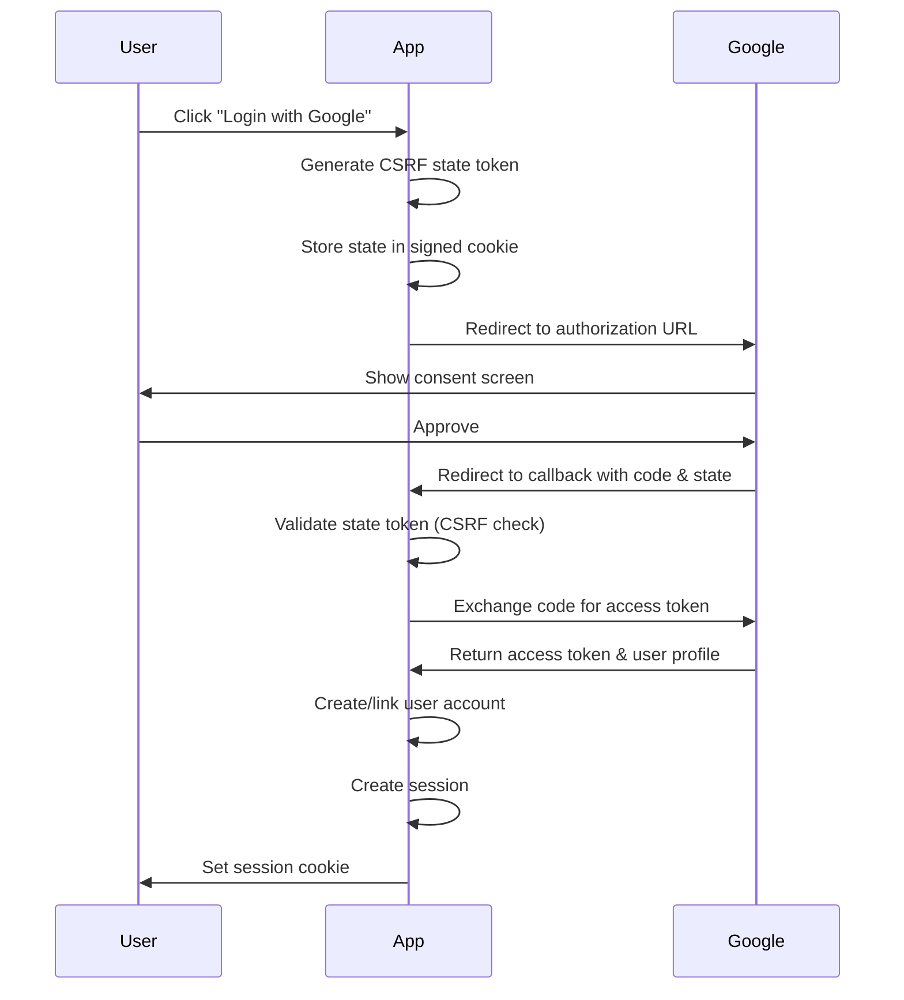

# OAuth

The OAuth plugin enables "Login with Google", "Login with GitHub", and other OAuth 2.0 / OpenID Connect authentication flows. It handles the complete OAuth lifecycle with CSRF protection, account linking, and token management.

## OAuth 2.0 Flow

### Standard Authorization Code Flow



1. **Initiate**: User clicks "Login with Google" → GET `/auth/oauth/google`
2. **State Token**: Plugin generates CSRF-protected state token
3. **Redirect**: User redirected to Google's authorization page
4. **Consent**: User approves permissions
5. **Callback**: Google redirects to `/auth/oauth/google/callback?code=...&state=...`
6. **Validate**: Plugin validates state token (CSRF protection)
7. **Exchange**: Plugin exchanges authorization code for access token
8. **Profile**: Plugin fetches user profile from Google
9. **Account**: Plugin creates or links Aegis user account
10. **Session**: Plugin creates authenticated session

## Supported Providers

### Built-In Providers (via Goth)

| Provider | Type | Configuration |
|----------|------|---------------|
| **Google** | OAuth 2.0 / OIDC | Client ID, Secret |
| **GitHub** | OAuth 2.0 | Client ID, Secret |
| **Apple** | OAuth 2.0 / OIDC | Client ID, Secret, Team ID |
| **Microsoft** | OAuth 2.0 / OIDC | Client ID, Secret, Tenant |
| **Discord** | OAuth 2.0 | Client ID, Secret |
| **LINE** | OAuth 2.0 | Client ID, Secret (Japan, Taiwan, Thailand) |
| **GitLab** | OAuth 2.0 | Client ID, Secret |
| **Slack** | OAuth 2.0 | Client ID, Secret |
| **Twitter** | OAuth 1.0a | API Key, Secret |
| **LinkedIn** | OAuth 2.0 | Client ID, Secret |
| **Spotify** | OAuth 2.0 | Client ID, Secret |
| **Twitch** | OAuth 2.0 | Client ID, Secret |
| **Amazon** | OAuth 2.0 | Client ID, Secret |
| **Bitbucket** | OAuth 2.0 | Client ID, Secret |

### Configuration

```go
import (
    "github.com/theinventorylib/aegis/plugins/oauth"
)

oauthPlugin := oauth.New(&oauth.Config{
    CallbackURL: "https://example.com/auth",
    Providers: []oauth.ProviderConfig{
        // Google OAuth
        {
            ProviderID:   "google",
            ProviderType: "google",
            ClientID:     os.Getenv("GOOGLE_CLIENT_ID"),
            ClientSecret: os.Getenv("GOOGLE_CLIENT_SECRET"),
            Scopes:       []string{"email", "profile"},
        },
        
        // GitHub OAuth
        {
            ProviderID:   "github",
            ProviderType: "github",
            ClientID:     os.Getenv("GITHUB_CLIENT_ID"),
            ClientSecret: os.Getenv("GITHUB_CLIENT_SECRET"),
            Scopes:       []string{"user:email"},
        },
        
        // Apple Sign In
        {
            ProviderID:   "apple",
            ProviderType: "apple",
            ClientID:     os.Getenv("APPLE_CLIENT_ID"),
            ClientSecret: os.Getenv("APPLE_CLIENT_SECRET"),
            Scopes:       []string{"email", "name"},
            Extra: map[string]string{
                "team_id": os.Getenv("APPLE_TEAM_ID"),
            },
        },
    },
}, nil)

auth := aegis.New(ctx, &config.Config{
    DB:      db,
    Plugins: []plugins.Plugin{oauthPlugin},
})
```

### Provider Setup

#### Google OAuth

1. Go to [Google Cloud Console](https://console.cloud.google.com)
2. Create project or select existing
3. Enable Google+ API
4. Create OAuth 2.0 credentials
5. Add authorized redirect URI: `https://yourdomain.com/auth/oauth/google/callback`
6. Copy Client ID and Client Secret

```go
{
    ProviderID:   "google",
    ProviderType: "google",
    ClientID:     "123456789-abc.apps.googleusercontent.com",
    ClientSecret: "GOCSPX-xxx",
    Scopes:       []string{"email", "profile", "openid"},
}
```

#### GitHub OAuth

1. Go to GitHub Settings → Developer settings → OAuth Apps
2. Click "New OAuth App"
3. Set Authorization callback URL: `https://yourdomain.com/auth/oauth/github/callback`
4. Copy Client ID and generate Client Secret

```go
{
    ProviderID:   "github",
    ProviderType: "github",
    ClientID:     "Iv1.xxxxx",
    ClientSecret: "xxxxx",
    Scopes:       []string{"user:email"},
}
```

#### Microsoft Azure AD

```go
{
    ProviderID:   "microsoft",
    ProviderType: "microsoft",
    ClientID:     os.Getenv("MICROSOFT_CLIENT_ID"),
    ClientSecret: os.Getenv("MICROSOFT_CLIENT_SECRET"),
    Scopes:       []string{"openid", "email", "profile"},
    Extra: map[string]string{
        "tenant": "common", // or specific tenant ID
    },
}
```

## Account Linking

### Automatic Linking by Email

When a user signs in with OAuth, Aegis automatically links to existing accounts with the same email:

```go
// Scenario 1: User registered with email/password
user1, _ := auth.EmailPassword.Register(ctx, "John", "john@example.com", "password")
// user1.ID = "user_abc123"

// User later signs in with Google (same email)
// → OAuth plugin automatically links Google account to user_abc123
// → User now has 2 accounts: credentials + google
```

### Manual Account Linking

Link additional providers to an authenticated user:

```go
// User already logged in
user, _ := core.GetUser(ctx)

// Link GitHub account
oauthPlugin.LinkAccount(ctx, user.GetID(), "github")
// → Redirects to GitHub OAuth flow
// → After approval, GitHub account linked to existing user

// User can now sign in with email/password OR GitHub
```

### Checking Linked Accounts

```go
connections, err := oauthStore.GetConnectionsByUserID(ctx, user.GetID())
for _, conn := range connections {
    fmt.Printf("Provider: %s, Linked: %s\n", conn.Provider, conn.CreatedAt)
}

// Output:
// Provider: google, Linked: 2024-01-15 10:30:00
// Provider: github, Linked: 2024-01-20 14:45:00
```

### Unlinking Accounts

```go
// Remove GitHub connection
err := oauthStore.DeleteConnection(ctx, user.GetID(), "github")

// User can no longer sign in with GitHub
// But email/password and Google still work
```

::callout{icon="i-heroicons-shield-check" color="amber"}
**Safety**: Aegis prevents unlinking the last authentication method. Users must have at least one way to sign in.
::

## State Management (CSRF Protection)

### How State Tokens Work

OAuth state tokens prevent CSRF attacks where attackers trick users into authorizing malicious apps:

```go
// 1. User clicks "Login with Google"
state := generateRandomState()  // Cryptographically secure random string
stateStore.Save(state, 15*time.Minute)  // Store in signed cookie

// 2. Redirect to Google with state parameter
redirectURL := fmt.Sprintf(
    "https://accounts.google.com/o/oauth2/v2/auth?client_id=%s&redirect_uri=%s&state=%s",
    clientID, callbackURL, state,
)

// 3. Google redirects back with same state
callbackState := r.URL.Query().Get("state")
if !stateStore.Validate(callbackState) {
    return errors.New("invalid state token - possible CSRF attack")
}

// 4. State validated → proceed with token exchange
```

### State Store Implementation

Aegis uses signed cookies for state storage:

```go
type StateStore struct {
    cookieManager *core.CookieManager
    secret        []byte  // Derived from Aegis master secret
}

func (s *StateStore) Create(w http.ResponseWriter) (string, error) {
    // Generate random state (32 bytes = 64 hex chars)
    state := generateRandomHex(32)
    
    // Store in signed cookie (HMAC signature prevents tampering)
    s.cookieManager.SetCustomCookie(w, core.CookieOptions{
        Name:     "oauth_state",
        Value:    state,
        MaxAge:   900,  // 15 minutes
        HTTPOnly: true,
        Secure:   true,
        SameSite: http.SameSiteLaxMode,
    })
    
    return state, nil
}

func (s *StateStore) Validate(r *http.Request, expectedState string) bool {
    cookie, err := r.Cookie("oauth_state")
    if err != nil {
        return false
    }
    
    // Constant-time comparison (prevents timing attacks)
    return subtle.ConstantTimeCompare([]byte(cookie.Value), []byte(expectedState)) == 1
}
```

## Custom Provider Configuration

### Generic OAuth 2.0 Provider

For providers not built into Goth:

```go
{
    ProviderID:   "custom",
    ProviderType: "openid-connect",  // Generic OIDC
    ClientID:     "your-client-id",
    ClientSecret: "your-client-secret",
    Scopes:       []string{"openid", "email", "profile"},
    Extra: map[string]string{
        "discovery_url": "https://provider.com/.well-known/openid-configuration",
    },
}
```

### Custom Provider with Manual Endpoints

```go
{
    ProviderID:   "custom-oauth",
    ProviderType: "oauth2",
    ClientID:     "client-id",
    ClientSecret: "client-secret",
    Scopes:       []string{"read", "write"},
    Extra: map[string]string{
        "auth_url":     "https://provider.com/oauth/authorize",
        "token_url":    "https://provider.com/oauth/token",
        "profile_url":  "https://provider.com/api/user",
    },
}
```

### Multiple Instances of Same Provider

Support multiple environments (staging, production):

```go
Providers: []oauth.ProviderConfig{
    {
        ProviderID:   "google-prod",
        ProviderType: "google",
        ClientID:     os.Getenv("GOOGLE_PROD_CLIENT_ID"),
        ClientSecret: os.Getenv("GOOGLE_PROD_SECRET"),
    },
    {
        ProviderID:   "google-staging",
        ProviderType: "google",
        ClientID:     os.Getenv("GOOGLE_STAGING_CLIENT_ID"),
        ClientSecret: os.Getenv("GOOGLE_STAGING_SECRET"),
    },
}
```

Users can choose which to use:
- `/auth/oauth/google-prod` → Production Google OAuth
- `/auth/oauth/google-staging` → Staging Google OAuth

## OAuth Token Storage

### Token Persistence

OAuth tokens are stored in the `oauth_connections` table:

```sql
CREATE TABLE oauth_connections (
    id TEXT PRIMARY KEY,
    user_id TEXT NOT NULL,
    provider TEXT NOT NULL,              -- "google", "github"
    provider_user_id TEXT NOT NULL,      -- Provider's user ID
    access_token TEXT,                   -- OAuth access token
    refresh_token TEXT,                  -- OAuth refresh token
    expires_at TEXT,                     -- Token expiration
    created_at TEXT NOT NULL,
    updated_at TEXT NOT NULL,
    UNIQUE(provider, provider_user_id),
    FOREIGN KEY (user_id) REFERENCES "user"(id) ON DELETE CASCADE
);
```

### Retrieving Tokens

```go
// Get OAuth connection for a user
connection, err := oauthStore.GetConnection(ctx, userID, "google")
if err != nil {
    return err
}

fmt.Println(connection.AccessToken)   // Use for API calls
fmt.Println(connection.RefreshToken)  // Use for token refresh
fmt.Println(connection.ExpiresAt)     // Check if expired
```

### Using Tokens for API Calls

```go
// Get user's Google OAuth token
connection, _ := oauthStore.GetConnection(ctx, userID, "google")

// Use access token to call Google APIs
client := &http.Client{}
req, _ := http.NewRequest("GET", "https://www.googleapis.com/gmail/v1/users/me/messages", nil)
req.Header.Set("Authorization", "Bearer "+connection.AccessToken)

resp, err := client.Do(req)
// Process Gmail API response
```

### Token Refresh

```go
// Check if token is expired
if time.Now().After(connection.ExpiresAt) {
    // Refresh token
    newToken, err := oauthPlugin.RefreshToken(ctx, userID, "google")
    if err != nil {
        return err
    }
    
    // Update stored token
    connection.AccessToken = newToken.AccessToken
    connection.ExpiresAt = time.Now().Add(time.Duration(newToken.ExpiresIn) * time.Second)
    oauthStore.UpdateConnection(ctx, connection)
}
```

## HTTP Routes

### Mounted Endpoints

When the OAuth plugin is registered, these routes are mounted:

| Method | Path | Description |
|--------|------|-------------|
| GET | `/auth/oauth/:provider` | Initiate OAuth flow for provider |
| GET | `/auth/oauth/:provider/callback` | OAuth callback endpoint |
| POST | `/auth/oauth/:provider/link` | Link provider to authenticated user |
| DELETE | `/auth/oauth/:provider/unlink` | Unlink provider from user |
| GET | `/auth/oauth/connections` | List user's OAuth connections |

### Frontend Integration

```html
<!-- Login buttons -->
<a href="/auth/oauth/google">
    <button>Login with Google</button>
</a>

<a href="/auth/oauth/github">
    <button>Login with GitHub</button>
</a>

<a href="/auth/oauth/apple">
    <button>Login with Apple</button>
</a>
```

After successful login, user is redirected with session cookie set.

### SPA / API Integration

```javascript
// Initiate OAuth flow
const loginWithGoogle = () => {
    window.location.href = '/auth/oauth/google';
};

// After redirect, get user info
fetch('/auth/me', {
    credentials: 'include'  // Include session cookie
})
.then(res => res.json())
.then(user => {
    console.log('Logged in as:', user.email);
});

// Link additional provider (user already authenticated)
const linkGitHub = async () => {
    const response = await fetch('/auth/oauth/github/link', {
        method: 'POST',
        credentials: 'include'
    });
    if (response.ok) {
        window.location.href = response.url;  // Redirect to GitHub
    }
};
```

## Security Considerations

### HTTPS Requirement

```go
// ✓ Production: Always use HTTPS
config := &oauth.Config{
    CallbackURL: "https://example.com/auth",  // HTTPS required
}

// ✗ Never use HTTP in production
config := &oauth.Config{
    CallbackURL: "http://example.com/auth",  // VULNERABLE
}
```

### State Token Validation

```go
// ✓ Aegis automatically validates state tokens
// No manual implementation needed

// ✗ Don't skip state validation
if skipValidation {
    // VULNERABLE TO CSRF ATTACKS
}
```

### Redirect URI Whitelist

Configure allowed redirect URIs in provider console:

```
✓ https://example.com/auth/oauth/google/callback
✓ https://staging.example.com/auth/oauth/google/callback
✗ https://evil.com/auth/oauth/google/callback  // Not allowed
```

### Token Storage Security

```go
// ✓ Tokens stored in database (server-side)
// ✓ Never exposed to client JavaScript
// ✓ Encrypted at rest (database encryption)

// ✗ Don't store tokens in:
// - localStorage (XSS vulnerable)
// - sessionStorage (XSS vulnerable)
// - Cookies accessible to JavaScript (XSS vulnerable)
```

## Examples

### Multi-Provider Login Page

```html
<!DOCTYPE html>
<html>
<head>
    <title>Login</title>
</head>
<body>
    <h1>Sign In</h1>
    
    <!-- Social login options -->
    <div class="oauth-buttons">
        <a href="/auth/oauth/google">
            <button>Continue with Google</button>
        </a>
        <a href="/auth/oauth/github">
            <button>Continue with GitHub</button>
        </a>
        <a href="/auth/oauth/apple">
            <button>Continue with Apple</button>
        </a>
    </div>
    
    <!-- Or traditional login -->
    <hr>
    <form action="/auth/login" method="POST">
        <input type="email" name="email" placeholder="Email" required>
        <input type="password" name="password" placeholder="Password" required>
        <button type="submit">Sign In with Email</button>
    </form>
</body>
</html>
```

### Account Settings - Linked Accounts

```go
func handleAccountSettings(w http.ResponseWriter, r *http.Request) {
    user, _ := core.GetUser(r.Context())
    
    // Get linked OAuth providers
    connections, _ := oauthStore.GetConnectionsByUserID(r.Context(), user.GetID())
    
    data := map[string]any{
        "user":        user,
        "connections": connections,
        "available_providers": []string{"google", "github", "apple"},
    }
    
    templates.ExecuteTemplate(w, "settings.html", data)
}
```

```html
<!-- settings.html -->
<h2>Linked Accounts</h2>
<ul>
    {{range .connections}}
    <li>
        {{.Provider}} - Linked {{.CreatedAt}}
        <form action="/auth/oauth/{{.Provider}}/unlink" method="POST">
            <button>Unlink</button>
        </form>
    </li>
    {{end}}
</ul>

<h3>Link New Provider</h3>
{{range .available_providers}}
    {{if not (hasConnection . $.connections)}}
    <a href="/auth/oauth/{{.}}/link">
        <button>Link {{.}}</button>
    </a>
    {{end}}
{{end}}
```

## API Reference

### OAuth Plugin Configuration

```go
type Config struct {
    Providers   []ProviderConfig  // OAuth providers to enable
    CallbackURL string            // Base callback URL
}

type ProviderConfig struct {
    ProviderID   string            // Unique identifier (e.g., "google")
    ProviderType string            // Provider type (e.g., "google", "github")
    ClientID     string            // OAuth client ID
    ClientSecret string            // OAuth client secret
    Scopes       []string          // Requested scopes
    Extra        map[string]string // Provider-specific config
}
```

### OAuth Store Interface

```go
type Store interface {
    CreateConnection(ctx context.Context, conn Connection) error
    GetConnection(ctx context.Context, userID, provider string) (*Connection, error)
    GetConnectionsByUserID(ctx context.Context, userID string) ([]Connection, error)
    UpdateConnection(ctx context.Context, conn Connection) error
    DeleteConnection(ctx context.Context, userID, provider string) error
}
```

### Connection Model

```go
type Connection struct {
    ID             string
    UserID         string
    Provider       string      // "google", "github"
    ProviderUserID string      // Provider's user ID
    AccessToken    string      // OAuth access token
    RefreshToken   string      // OAuth refresh token
    ExpiresAt      time.Time   // Token expiration
    CreatedAt      time.Time
    UpdatedAt      time.Time
}
```

## See Also

- [Plugins](/concepts/plugins) — Plugin architecture and lifecycle
- [Sessions](/concepts/sessions) — Post-OAuth session management
- [Users & Accounts](/concepts/users-accounts) — Account linking and management
- [Database](/concepts/database) — OAuth schema details
