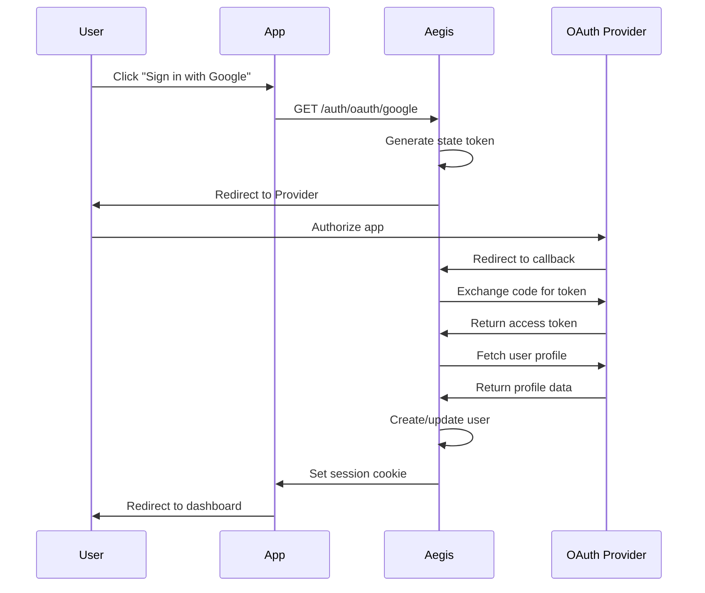

Social sign-on allows users to authenticate using their existing accounts from providers like Google, GitHub, Apple, and many others. Aegis uses the OAuth 2.0 and OpenID Connect protocols to securely authenticate users without handling their passwords.

## Quick Start

```go
import (
    "github.com/theinventorylib/aegis"
    "github.com/theinventorylib/aegis/plugins/oauth"
)

// Configure OAuth providers
oauthPlugin := oauth.New(&oauth.Config{
    CallbackURL: "https://yourapp.com/auth",
    Providers: []oauth.ProviderConfig{
        oauth.Google(
            os.Getenv("GOOGLE_CLIENT_ID"),
            os.Getenv("GOOGLE_CLIENT_SECRET"),
        ),
        oauth.GitHub(
            os.Getenv("GITHUB_CLIENT_ID"),
            os.Getenv("GITHUB_CLIENT_SECRET"),
        ),
    },
})

// Initialize Aegis and register OAuth plugin
cfg := config.Default().WithDB(db).WithRouter(router).WithSecret(secret)
a, err := aegis.New(context.Background(), cfg)
if err != nil {
    log.Fatal(err)
}
a.Use(context.Background(), oauthPlugin)
a.MountRoutes("/auth")
```

## OAuth Flow



## Supported Providers

Aegis supports 20+ OAuth providers out of the box:

### Popular Providers

| Provider | Type | ProviderType | Default Scopes |
|----------|------|--------------|----------------|
| **Google** | OAuth 2.0 / OIDC | `google` | `openid`, `email`, `profile` |
| **GitHub** | OAuth 2.0 | `github` | `user:email` |
| **Apple** | OAuth 2.0 / OIDC | `apple` | `name`, `email` |
| **Microsoft** | OAuth 2.0 / OIDC | `microsoft` | `openid`, `email`, `profile` |
| **Facebook** | OAuth 2.0 | `facebook` | `email`, `public_profile` |
| **Discord** | OAuth 2.0 | `discord` | `identify`, `email` |

### Business & Enterprise

| Provider | ProviderType | Notes |
|----------|--------------|-------|
| **Microsoft** | `microsoft` | Azure AD, Office 365 |
| **Slack** | `slack` | Workspace OAuth |
| **GitLab** | `gitlab` | Self-hosted support |
| **Atlassian** | `atlassian` | Jira, Confluence |

### Developer Platforms

| Provider | ProviderType | Notes |
|----------|--------------|-------|
| **GitHub** | `github` | Public repos by default |
| **GitLab** | `gitlab` | Self-hosted GitLab instances |
| **Bitbucket** | `bitbucket` | Atlassian accounts |

### Social & Communication

| Provider | ProviderType | Notes |
|----------|--------------|-------|
| **Facebook** | `facebook` | Personal accounts |
| **Discord** | `discord` | Gaming communities |
| **LINE** | `line` | Popular in Asia |
| **Twitter** | `twitter` | OAuth 1.0a |

### Media & Entertainment

| Provider | ProviderType | Default Scopes |
|----------|--------------|----------------|
| **Spotify** | `spotify` | `user-read-email`, `user-read-private` |
| **Twitch** | `twitch` | `user:read:email` |
| **Figma** | `figma` | `file_read` |

### Other Providers

- **LinkedIn** (`linkedin`)
- **Amazon** (`amazon`)
- **Dropbox** (`dropbox`)
- **Cognito** (`cognito`)

## Provider Configuration

### Google

```go
oauth.Google(
    "123456.apps.googleusercontent.com",
    "client-secret",
    oauth.WithScopes("email", "profile", "calendar.readonly"),
    oauth.WithPrompt("consent"), // Force consent screen
)
```

**Setup:**
1. Go to [Google Cloud Console](https://console.cloud.google.com/)
2. Create OAuth 2.0 credentials
3. Add authorized redirect URI: `https://yourapp.com/auth/oauth/google/callback`

### GitHub

```go
oauth.GitHub(
    "github-client-id",
    "github-client-secret",
    oauth.WithScopes("user:email", "read:org"),
)
```

**Setup:**
1. Go to [GitHub Developer Settings](https://github.com/settings/developers)
2. Create new OAuth App
3. Set callback URL: `https://yourapp.com/auth/oauth/github/callback`

### Apple

```go
oauth.Apple(
    "com.yourapp.service-id",
    jwtSecret, // JWT signed with your private key
    oauth.WithScopes("name", "email"),
)
```

**Setup:**
1. Go to [Apple Developer](https://developer.apple.com/)
2. Create Service ID and configure Sign in with Apple
3. Generate client secret (JWT) using your Team ID and private key

::callout{icon="i-heroicons-exclamation-triangle" color="amber"}
Apple Sign In requires a JWT as the client secret, not a simple string. You must generate and sign it with your Apple private key.
::

### Discord

```go
oauth.Discord(
    "discord-app-id",
    "discord-client-secret",
    oauth.WithScopes("identify", "email", "guilds"),
)
```

**Setup:**
1. Go to [Discord Developer Portal](https://discord.com/developers/applications)
2. Create application and add OAuth2 redirect
3. Callback: `https://yourapp.com/auth/oauth/discord/callback`

### Microsoft (Azure AD)

```go
oauth.Microsoft(
    "azure-client-id",
    "azure-client-secret",
    "common", // or specific tenant ID
    oauth.WithScopes("openid", "email", "profile"),
)
```

**Setup:**
1. Go to [Azure Portal](https://portal.azure.com/)
2. Register application in Azure AD
3. Add redirect URI: `https://yourapp.com/auth/oauth/microsoft/callback`

### Atlassian

```go
oauth.Atlassian(
    "atlassian-client-id",
    "atlassian-client-secret",
    oauth.WithScopes("read:me", "read:jira-user"),
)
```

**Setup:**
1. Go to [Atlassian Developer Console](https://developer.atlassian.com/console)
2. Create OAuth 2.0 integration
3. Callback: `https://yourapp.com/auth/oauth/atlassian/callback`

### Cognito

```go
oauth.Cognito(
    "cognito-client-id",
    "cognito-client-secret",
    "us-east-1_XXXXX", // User pool ID
    "us-east-1",       // Region
)
```

**Setup:**
1. Create User Pool in AWS Cognito
2. Add OAuth provider configuration
3. Set callback URL in app client settings

### Dropbox

```go
oauth.Dropbox(
    "dropbox-app-key",
    "dropbox-app-secret",
)
```

### Facebook

```go
oauth.Facebook(
    "facebook-app-id",
    "facebook-app-secret",
    oauth.WithScopes("email", "public_profile", "user_friends"),
)
```

### Figma

```go
oauth.Figma(
    "figma-client-id",
    "figma-client-secret",
)
```

### GitLab (Self-Hosted)

```go
oauth.GitLab(
    "gitlab-app-id",
    "gitlab-app-secret",
    oauth.WithBaseURL("https://gitlab.yourcompany.com"),
)
```

## Account Linking

Aegis automatically links OAuth accounts to existing users based on email address.

### Automatic Linking

When a user signs in with Google and the email matches an existing account:

```go
// User already exists with email john@example.com
// User signs in with Google (john@example.com)
// → Automatically linked to existing account
```

### Manual Linking

Allow users to link multiple OAuth providers to their account:

```go
// User must be already authenticated
GET /auth/oauth/link/github

// Links GitHub account to current user
```

### Multiple Providers

Users can have multiple OAuth accounts linked:

```go
// User profile with multiple providers
{
  "user_id": "usr_123",
  "email": "john@example.com",
  "oauth_accounts": [
    {
      "provider": "google",
      "provider_user_id": "108...",
      "email": "john@example.com"
    },
    {
      "provider": "github",
      "provider_user_id": "12345",
      "email": "john@example.com"
    }
  ]
}
```

## Security Features

### CSRF Protection

Aegis protects against CSRF attacks using signed state tokens:

```go
// State token is automatically:
// 1. Generated with cryptographic random data
// 2. Signed with HMAC-SHA256
// 3. Verified on callback
// 4. Single-use (expires after 15 minutes)
```

### Token Storage

OAuth tokens are securely stored:

- **Access tokens**: Encrypted in database
- **Refresh tokens**: Encrypted in database
- **State tokens**: In-memory cache (Redis or local)

### Scopes

Request minimal scopes needed for your application:

```go
// ❌ Bad - requesting unnecessary permissions
oauth.Google(id, secret,
    oauth.WithScopes("email", "profile", "calendar", "drive"),
)

// ✅ Good - only email and profile
oauth.Google(id, secret,
    oauth.WithScopes("email", "profile"),
)
```

## HTTP Routes

| Method | Path | Description | Auth Required |
|--------|------|-------------|---------------|
| `GET` | `/auth/oauth/:provider` | Initiate OAuth flow | No |
| `GET` | `/auth/oauth/:provider/callback` | OAuth callback handler | No |
| `POST` | `/auth/oauth/:provider/refresh` | Refresh access token | Yes |
| `POST` | `/auth/oauth/link` | Link provider to existing account | Yes |
| `POST` | `/auth/oauth/logout` | Clear OAuth state | No |

## API Reference

### Configuration Options

```go
type Config struct {
    // CallbackURL is the base URL for OAuth callbacks
    CallbackURL string
    
    // Providers is the list of OAuth providers to enable
    Providers []ProviderConfig
    
    // AutoLinkAccounts enables automatic account linking by email
    AutoLinkAccounts bool // Default: true
    
    // StateExpiry is how long state tokens are valid
    StateExpiry time.Duration // Default: 15 minutes
}
```

### Provider Config

```go
type ProviderConfig struct {
    // Identity
    ProviderID   string // Unique ID (e.g., "google", "github-enterprise")
    ProviderType string // Provider type (e.g., "google", "github")
    
    // OAuth Credentials
    ClientID     string
    ClientSecret string
    
    // Scopes
    Scopes []string
    
    // Optional: Custom endpoints (for generic providers)
    AuthURL      string
    TokenURL     string
    UserInfoURL  string
    DiscoveryURL string // OIDC discovery endpoint
}
```

### Helper Functions

```go
// Pre-configured providers
func Google(clientID, secret string, opts ...ProviderOption) ProviderConfig
func GitHub(clientID, secret string, opts ...ProviderOption) ProviderConfig
func Apple(clientID, secret string, opts ...ProviderOption) ProviderConfig
func Microsoft(clientID, secret, tenant string, opts ...ProviderOption) ProviderConfig
func Discord(clientID, secret string, opts ...ProviderOption) ProviderConfig
// ... and 15+ more

// Customization options
func WithScopes(scopes ...string) ProviderOption
func WithProviderID(id string) ProviderOption
func WithBaseURL(url string) ProviderOption
func WithPrompt(prompt string) ProviderOption
```

## Best Practices

1. **Use environment variables** for client IDs and secrets
2. **Request minimal scopes** - only what you need
3. **Implement account linking** - allow users to connect multiple providers
4. **Handle email verification** - some providers don't verify emails
5. **Store OAuth tokens securely** - encrypt sensitive data
6. **Refresh tokens proactively** — call `POST /auth/oauth/:provider/refresh` (or `RefreshConnection` programmatically) before the access token expires; not all providers support refresh (e.g., GitHub)
7. **Monitor provider changes** - OAuth APIs can change
8. **Test callback URLs** - ensure they match provider configuration exactly

## Troubleshooting

### "Invalid redirect URI" error

- Verify callback URL matches provider configuration exactly
- Check for trailing slashes (`/callback` vs `/callback/`)
- Ensure HTTPS in production (some providers require it)

### User profile missing email

- Some providers don't include email by default (Twitter, Apple)
- Request appropriate scopes (`email` scope for most providers)
- Handle missing emails gracefully (request email separately)

### State token mismatch

- Check that cookies are enabled
- Verify `SameSite` cookie attribute allows OAuth flow
- Ensure state tokens aren't expiring (default: 15 minutes)

### Account linking not working

- Verify `AutoLinkAccounts: true` in configuration
- Check that emails match exactly (case-sensitive)
- Ensure email verification status is handled

### Provider-specific errors

- **Apple**: Client secret must be a valid JWT
- **Microsoft**: Tenant ID required for single-tenant apps
- **LINE**: Different channels for different countries
- **GitLab**: Self-hosted instances need custom base URL

## Related Documentation

- [OAuth Plugin](/plugins/oauth) - Detailed plugin documentation
- [Sessions](/concepts/sessions) - Session management after OAuth
- [Database](/concepts/database) - OAuth accounts schema
- [Security Best Practices](/guides/security) - Secure your OAuth implementation
