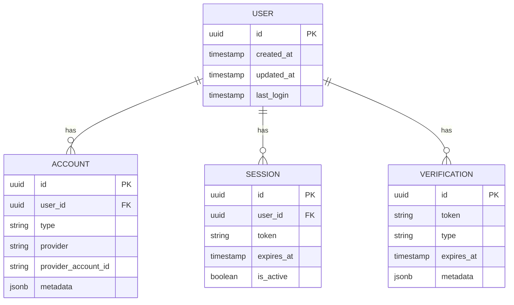

# Core Concepts

Understanding the core architecture of Aegis will help you integrate it effectively and build custom plugins.

## Architecture Overview

Aegis is built around a modular **Plugin Architecture**. The core library handles:

- **Session Management**: Creating, validating, and refreshing user sessions.
- **JWT Handling**: Signing and verifying JSON Web Tokens.
- **Database Abstraction**: Providing a unified interface for database operations.
- **Router**: A lightweight HTTP router for handling auth endpoints.

All specific authentication methods (Email, Password, OAuth, etc.) are implemented as **Plugins**.

## Database Provider (DBProvider)

Aegis uses a `DBProvider` interface to interact with the database. This allows it to be database-agnostic.

We provide a standard SQL implementation (`db.SQLProvider`) that works with `database/sql`.

```go
// Initialize with standard sql.DB
auth, _ := aegis.New(
    config.WithDB(sqlDB, db.PostgreSQL), // or db.MySQL, db.SQLite
)
```

This design means you can use **any** database driver that supports `database/sql`.

## Core Schema

Aegis maintains a **minimal core schema** to avoid bloating your database. It consists of 5 essential tables:

1. **`auth.user`**: The central user identity. Contains `id`, `created_at`, `updated_at`, and `last_login`.
2. **`auth.accounts`**: Links authentication methods (like a password or OAuth provider) to a user.
3. **`auth.verification`**: Stores temporary verification tokens (for email verification, password reset, etc.).
4. **`auth.session`**: Manages active user sessions and refresh tokens.
5. **`auth.jwks`**: Stores JSON Web Key Sets for rotating JWT signing keys.

### Schema Diagram



## Plugins

Plugins extend the core functionality. They can:

- **Register new routes**: e.g., `/auth/login`, `/auth/callback`.
- **Manage their own tables**: e.g., `plugins_email` might add an `email` column or table.
- **Hook into lifecycle events**: e.g., sending an email after registration.

See the [Plugins](./plugins.md) section for more details.
