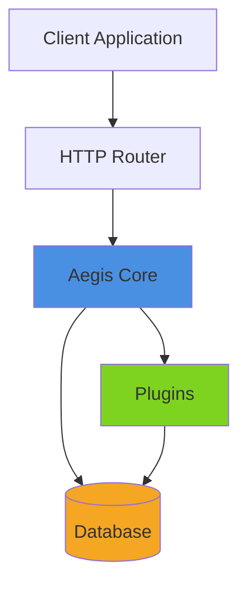
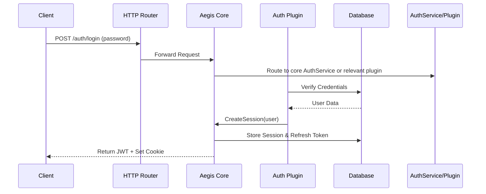
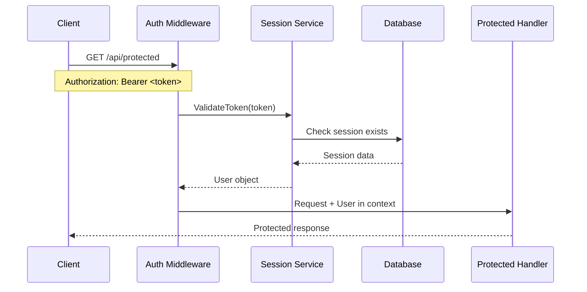
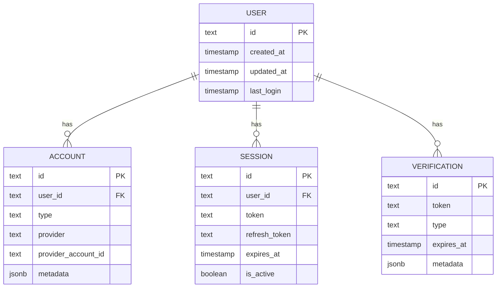

# Core Concepts

Understanding Aegis's architecture and core concepts will help you integrate it effectively and build custom plugins.

## Architecture Overview

Aegis is designed as a **modular middleware** that sits between your HTTP router and your application logic. It handles authentication requests, manages sessions, and provides a unified identity layer.

### Design Philosophy

- **Minimal Core**: Only essential authentication features in the core
- **Plugin-Based**: Most auth methods are plugins (Email, OAuth). Password-based authentication is provided by core and available to plugins and application code.
- **Database Agnostic**: Works with PostgreSQL, MySQL, SQLite, and more
- **No Magic**: You control migrations, configuration, and deployment
- **Type-Safe**: Fully typed Go API with compile-time safety

### High-Level Architecture



---

## Core Components

### 1. Database Provider (DBProvider)

The `DBProvider` interface abstracts database operations, allowing Aegis to work with any SQL database.

```go
type DBProvider interface {
    Query(query string, args ...interface{}) (*sql.Rows, error)
    QueryRow(query string, args ...interface{}) *sql.Row
    Exec(query string, args ...interface{}) (sql.Result, error)
    Begin() (*sql.Tx, error)
    Close() error
}
```

**Implementation:**
- `db.SQLProvider` - Standard SQL implementation using `database/sql`
- Supports PostgreSQL, MySQL, SQLite through dialects
- Handles query placeholder translation (`$1` vs `?`)

**Usage:**
```go
// Bring your own database connection
sqlDB, _ := sql.Open("postgres", connString)
auth, _ := aegis.New(
    config.WithDB(sqlDB, db.PostgreSQL),
)
```

### 2. Session Manager

Manages user sessions, JWT tokens, and refresh tokens.

**Responsibilities:**
- Create sessions on successful authentication
- Validate session tokens (JWT)
- Refresh expired tokens
- Revoke sessions on logout
- Store refresh tokens in database

**Session Flow:**
1. User authenticates → Session created
2. JWT (short-lived) + Refresh token (long-lived) returned
3. Client sends JWT with requests
4. JWT expires → Client uses refresh token
5. New JWT issued

### 3. Router Abstraction

Aegis works with any HTTP router through the `server.Router` interface.

**Built-in adapters:**
- `server.DefaultRouter` - Wraps `http.ServeMux`
- `server.ChiRouter` - Wraps `chi.Router`

**Custom routers:**
Implement the `server.Router` interface for other routers (Gin, Echo, etc.)

### 4. Plugin System

Plugins extend Aegis functionality without bloating the core.

**Plugin capabilities:**
- Register new routes
- Add database tables (via migrations)
- Hook into lifecycle events
- Depend on other plugins
- Provide authentication methods

**Plugin lifecycle:**
1. **Registration**: `auth.Use(ctx, plugin)`
2. **Initialization**: `plugin.Init(ctx, aegis)` called
3. **Route Mounting**: `plugin.MountRoutes(router, prefix)` called
4. **Runtime**: Plugin handles requests

---

## Request Flow

### Authentication Flow

Here's how a typical authentication request flows through Aegis:



**Step-by-step:**

1. **Client Request**: User submits credentials to `/auth/login` (password)
2. **Router**: Forwards to Aegis-mounted routes
3. **Routing**: Aegis dispatches the request to the core AuthService or the appropriate plugin handler
4. **Credential Verification**: Plugin checks credentials against database
5. **Session Creation**: Plugin calls `aegis.CreateSession(user)`
6. **Token Generation**: Aegis generates JWT and refresh token
7. **Storage**: Refresh token stored in `auth.session` table
8. **Response**: JWT returned in response, session cookie set

### Session Validation Flow

For protected routes:



**Step-by-step:**

1. **Request**: Client sends request with JWT (cookie or Bearer token)
2. **Middleware**: `AuthMiddleware` intercepts request
3. **Token Validation**: JWT signature verified
4. **Session Check**: Refresh token validated in database
5. **Context Injection**: User object injected into request context
6. **Handler**: Your handler accesses user via `aegis.GetUser(r.Context())`

---

## Core Schema

Aegis maintains a **minimal core schema** with only 4 essential tables:

### Database Tables

#### 1. `auth.user`
The central user identity.

```sql
CREATE TABLE auth.user (
    id TEXT PRIMARY KEY,
    created_at TIMESTAMP NOT NULL DEFAULT NOW(),
    updated_at TIMESTAMP NOT NULL DEFAULT NOW(),
    last_login TIMESTAMP
);
```

**Fields:**
- `id` - Unique user identifier (ULID by default)
- `created_at` - Account creation timestamp
- `updated_at` - Last update timestamp
- `last_login` - Last successful login

#### 2. `auth.accounts`
Links authentication methods to users.

```sql
CREATE TABLE auth.accounts (
    id TEXT PRIMARY KEY,
    user_id TEXT NOT NULL REFERENCES auth.user(id),
    type TEXT NOT NULL,
    provider TEXT,
    provider_account_id TEXT,
    metadata JSONB DEFAULT '{}',
    created_at TIMESTAMP NOT NULL DEFAULT NOW()
);
```

**Purpose:** A user can have multiple accounts (password + Google OAuth, etc.)

**Example rows:**
```
id: "01ARZ3...", user_id: "01ARY2...", type: "password", provider: null
id: "01ARZ4...", user_id: "01ARY2...", type: "oauth", provider: "google"
```

#### 3. `auth.session`
Manages active user sessions.

```sql
CREATE TABLE auth.session (
    id TEXT PRIMARY KEY,
    user_id TEXT NOT NULL REFERENCES auth.user(id),
    token TEXT NOT NULL UNIQUE,
    refresh_token TEXT UNIQUE,
    expires_at TIMESTAMP NOT NULL,
    refresh_expires_at TIMESTAMP,
    is_active BOOLEAN DEFAULT true,
    created_at TIMESTAMP NOT NULL DEFAULT NOW()
);
```

**Purpose:** Track active sessions and refresh tokens

#### 4. `auth.verification`
Stores temporary verification tokens.

```sql
CREATE TABLE auth.verification (
    id TEXT PRIMARY KEY,
    token TEXT NOT NULL UNIQUE,
    type TEXT NOT NULL,
    expires_at TIMESTAMP NOT NULL,
    metadata JSONB DEFAULT '{}',
    created_at TIMESTAMP NOT NULL DEFAULT NOW()
);
```

**Purpose:** Email verification, password reset, OTP codes, etc.

### Entity Relationship Diagram



---

## Route Protection

Aegis provides middleware for protecting routes that require authentication.

### AuthMiddleware

Validates sessions and injects user into context (does NOT reject unauthenticated requests).

```go
// Apply to routes where you want user info if available
router.Use(auth.AuthMiddleware())

// In your handler
func handler(w http.ResponseWriter, r *http.Request) {
    if auth.Authenticated(r.Context()) {
        user, _ := auth.GetUser(r.Context())
        // User is logged in
    } else {
        // User is not logged in (but request continues)
    }
}
```

**Behavior:**
- ✅ Validates JWT from cookie or `Authorization` header
- ✅ Injects user into context if valid
- ✅ Continues to handler even if unauthenticated

### RequireAuth Middleware

Requires authentication (rejects unauthenticated requests with 401).

```go
// Protect specific routes
protectedHandler := auth.RequireAuth()(http.HandlerFunc(myHandler))
router.Handle("/api/protected", protectedHandler)

// Or protect a group of routes
router.Group(func(r chi.Router) {
    r.Use(auth.RequireAuth())
    r.Get("/api/profile", profileHandler)
    r.Get("/api/settings", settingsHandler)
})
```

**Behavior:**
- ✅ Validates JWT from cookie or `Authorization` header
- ❌ Returns 401 if no valid session
- ✅ Injects user into context
- ✅ Continues to handler only if authenticated

### Context Helpers

```go
// Get authenticated user
user, err := auth.GetUser(r.Context())
if err != nil {
    // Not authenticated
}

// Check if authenticated
if auth.Authenticated(r.Context()) {
    // User is logged in
}
```

---

## Plugin System

### How Plugins Work

Plugins implement the `plugins.Plugin` interface:

```go
type Plugin interface {
    // Identity
    Name() string
    Version() string
    Description() string
    
    // Lifecycle
    Init(ctx context.Context, a Aegis) error
    GetMigrations() []Migration
    
    // Routing
    MountRoutes(router server.Router, prefix string)
    
    // Metadata
    Dependencies() []Dependency
    RequiresTables() []string
    ProvidesAuthMethods() []string
}
```

### Plugin Lifecycle

1. **Registration**: `auth.Use(ctx, plugin)` or `auth.UseWithPriority(ctx, plugin, priority)`
2. **Initialization**: `plugin.Init(ctx, aegis)` called immediately
3. **Route Mounting**: `plugin.MountRoutes(router, prefix)` called when `auth.MountRoutes()` is called
4. **Runtime**: Plugin handles requests to its routes

### Plugin Priorities

Plugins are initialized in priority order (lower = first):

- **0-50**: Critical infrastructure (JWT, session management)
-- **51-99**: High-priority auth plugins (email, oauth) — password support is provided by core
- **100**: Default priority (when using `Use()`)
- **101-150**: Standard plugins (OAuth, SMS)
- **151+**: Low-priority plugins (admin, analytics)

**Example:**
```go
// Example: OAuth with high priority, email later
auth.UseWithPriority(ctx, oauthPlugin, 65)
auth.Use(ctx, emailPlugin)
```

See [Plugin Priorities Guide](./plugin-priorities.md) for details.

### Plugin Categories

**Authentication Plugins:**
- Password (core) - Email/phone + password authentication is provided by core
- Email - Email verification and magic links
- SMS - Phone number verification
- OAuth - Social login (Google, GitHub, etc.)

**Token & Security Plugins:**
- JWT - Token generation and validation
- Bearer - Bearer token authentication support

**Management Plugins:**
- Admin - Administrative endpoints
- Organizations - Multi-tenant support
- Rate Limit - Rate limiting middleware

**Documentation Plugins:**
- OpenAPI - API documentation with Scalar UI

See [Plugins Guide](./plugins.md) for complete documentation.

---

## Detailed Component Interaction

### Initialization

When you call `aegis.New()`:

1. **Configuration Validation**: All required options checked
2. **Database Provider**: Initialized with SQL connection
3. **Router Setup**: Router adapter configured
4. **Session Service**: Created with JWT secret
5. **Plugin Registration**: Plugins registered via `Use()`
6. **Plugin Initialization**: Each plugin's `Init()` called in priority order
7. **Ready**: Aegis instance ready to mount routes

### Authentication Process

When a user authenticates (e.g., via password login or an auth plugin):

1. **Validate Credentials**: Core `AuthService` or the plugin handler checks credentials
2. **User Lookup**: Core/plugin queries `auth.user` and `auth.accounts`
3. **Session Creation**: Call `aegis.CreateSession(user)` to create session
4. **Token Generation**: 
   - JWT (short-lived, e.g., 15 minutes)
   - Refresh token (long-lived, e.g., 7 days)
5. **Storage**: Refresh token stored in `auth.session`
6. **Response**: JWT returned, session cookie set

### Session Validation

For protected routes:

1. **Middleware Intercepts**: `AuthMiddleware` or `RequireAuth`
2. **Token Extraction**: From `Authorization` header or cookie
3. **JWT Verification**: Signature verified using JWKS
4. **Session Lookup**: Refresh token validated in database
5. **User Injection**: User object injected into context
6. **Handler Execution**: Your handler accesses user

---

## Data Model

### User Identity

- **User (`auth.user`)**: The identity
- **Account (`auth.accounts`)**: The credential(s)
- **Session (`auth.session`)**: The active login state

**Key insight:** A user can have multiple accounts (password + Google + GitHub), but only one user identity.

### Plugin Extensions

Plugins can extend the data model:

- **Email Plugin**: Adds `email` and `email_verified` columns to `auth.user`
- **SMS Plugin**: Adds `phone_number` and `phone_verified` columns
- **Organizations Plugin**: Adds `organizations` and `memberships` tables

All plugin tables should link back to `auth.user` via foreign keys.

---

## Thread-Safety

All public Aegis methods are thread-safe:

- ✅ `Use` / `UseWithPriority` - Safe to call concurrently
- ✅ `GetPlugin` / `GetPlugins` - Safe to call concurrently
- ✅ `AuthMiddleware` / `RequireAuth` - Safe to use in multiple goroutines
- ✅ `GetUser` / `Authenticated` - Safe to call concurrently

See [Concurrency Best Practices](./concurrency-best-practices.md) for details.

---

## Next Steps

- **[Getting Started](./getting-started.md)** - Build your first Aegis app
- **[Plugins](./plugins.md)** - Add authentication methods
- **[API Reference](./api-reference.md)** - Complete API documentation
- **[Database Setup](./database-setup.md)** - Advanced database configuration
- **[Testing Guide](./testing-guide.md)** - Test your authentication
